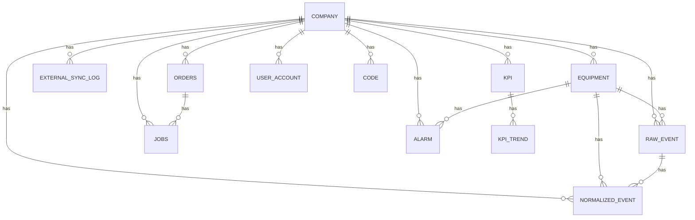

# PR-14: ERD(초안)

## 목적
- DB 초안 완료 시점에 ERD를 문서화한다.
- DB 변경 시 동일 문서를 갱신한다.

## ERD(초안)

## 비고
- 테이블/관계 변경 시 본 문서를 즉시 갱신한다.

## PR-19 변경사항(초안 반영)
- ORDERS: product_code, product_name, quantity 컬럼 추가
- JOBS: equipment_id, operator_name 컬럼 추가
- KPI: remark, kpi_date 컬럼 추가

## PR-33 변경사항(초안 반영)
- EXTERNAL_SYNC_LOG: 외부기관 연계 요청 이력 테이블 추가
